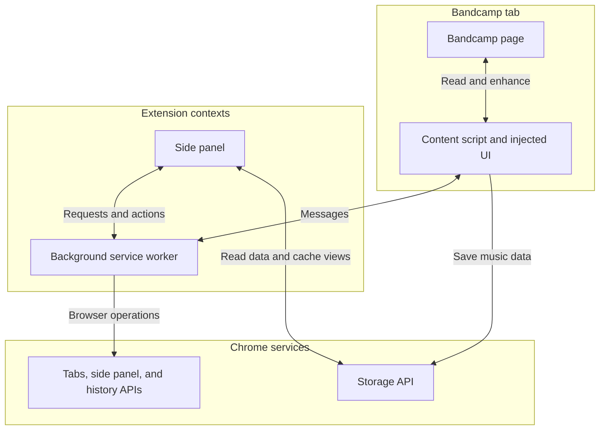

# Extension architecture overview

BCX is a Chrome extension that enhances Bandcamp pages and shows music data in a side panel. The background service worker coordinates requests between the side panel, content scripts, and Chrome APIs.

The content scripts work within Bandcamp tabs. The side panel presents the collected data and sends page-related requests through the background service worker. Both use shared models and helpers, while Chrome storage keeps data available across extension contexts.
