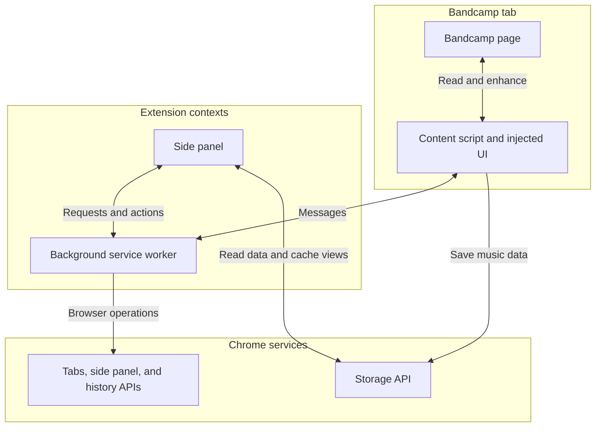

# Extension architecture overview

BCX is a Chrome extension that enhances Bandcamp pages and shows music data in a side panel. The background service worker coordinates requests between the side panel, content scripts, and Chrome APIs.

```mermaid
flowchart TB
    subgraph tab[Bandcamp tab]
        page[Bandcamp page]
        content[Content script and injected UI]
        page <-->|Read and enhance| content
    end

    subgraph extension[Extension contexts]
        panel[Side panel]
        background[Background service worker]
        panel <-->|Requests and actions| background
    end

    subgraph browser[Chrome services]
        apis[Tabs, side panel, and history APIs]
        storage[Storage API]
    end

    content <-->|Messages| background
    background -->|Browser operations| apis
    content -->|Save music data| storage
    panel <-->|Read data and cache views| storage
```

The content scripts work within Bandcamp tabs. The side panel presents the collected data and sends page-related requests through the background service worker. Both use shared models and helpers, while Chrome storage keeps data available across extension contexts.

## Activity log

The Activity log groups Sync, availability checks, current storage measurements,
and storage-history captures into operations with timestamped events and outcomes.
Only the background worker writes `/activity-log/operations` in local storage;
serialized writes avoid lost updates across concurrent processes and panel instances.
Panels read the validated, versioned records and subscribe to storage changes.
Current storage measurement requests run in the worker so recording can finish when
the panel closes. The existing daily storage-history snapshots remain separate.

Retention is bounded to seven days, 200 operations, and 256 KB of serialized log
payload, with at most 40 events per operation and 500 characters per message.
Expired operations are excluded on read and pruned on writes. Worker startup marks
unfinished operations with a warning; interrupted fan sync gets its specific failure
message through the existing recovery flow. Logging errors go to the developer
console without failing the underlying operation.

Storage-history change monitoring ignores both its own snapshot key and the activity
log key to prevent measurement feedback loops. Activity log data has its own storage
category. Routine automatic captures are hidden by default; warnings and failures
remain visible. Copy and export use the currently filtered operations. Clearing the
log removes all retained operations, including running entries, without cancelling
processes; later updates to removed entries do not recreate them.
