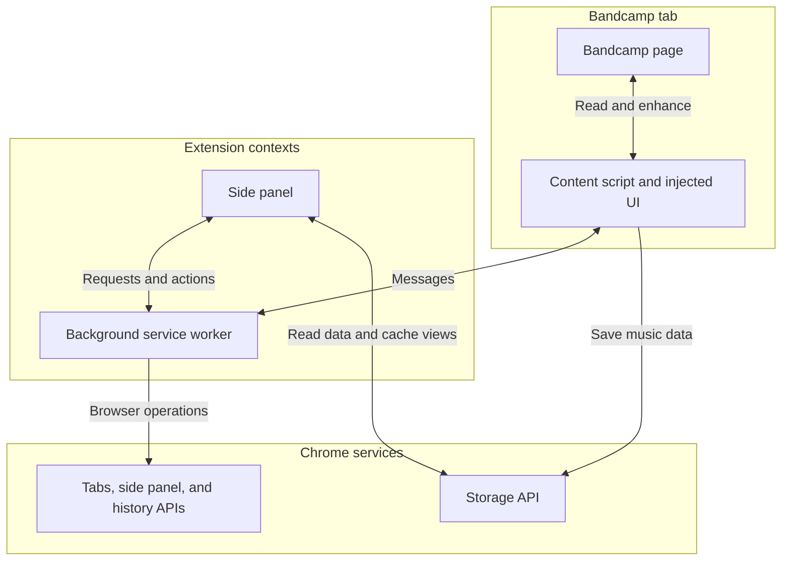

# Extension architecture overview

BCX is a Chrome extension that enhances Bandcamp pages and shows music data in a side panel. The background service worker coordinates requests between the side panel, content scripts, and Chrome APIs.

```mermaid
flowchart TB
    subgraph tab[Bandcamp tab]
        page[Bandcamp page]
        content[Content script and injected UI]
        page <-->|Read and enhance| content
    end

    subgraph extension[Extension contexts]
        panel[Side panel]
        background[Background service worker]
        panel <-->|Requests and actions| background
    end

    subgraph browser[Chrome services]
        apis[Tabs, side panel, and history APIs]
        storage[Storage API]
    end

    content <-->|Messages| background
    background -->|Browser operations| apis
    content -->|Save music data| storage
    panel <-->|Read data and cache views| storage
```

The content scripts work within Bandcamp tabs. The side panel presents the collected data and sends page-related requests through the background service worker. Both use shared models and helpers, while Chrome storage keeps data available across extension contexts.

## Pinned navigation

Band, release, and track shortcuts are stored separately from music data and
catalog caches in `/ui/pinned-navigation` in `chrome.storage.local`. The versioned
document contains an ordered list of canonical destinations, display names,
artwork URLs, and entity IDs when known. Artwork is optional for compatibility
with existing pins; their icons use locally saved music data when available.
Album and track IDs have separate namespaces. A URL-only
pin keeps its navigation identity when a saved entity ID becomes available; known
aliases merge without moving the original shortcut.

Only the background worker writes the document. Pin, unpin, and reorder commands
read durable state inside a serialized queue, and errors are returned to the
caller. Panels subscribe to storage changes and show confirmed saves. Invalid
records and unsupported schema versions block writes while preserving the stored
document. Selecting a pin reuses BCX's saved band/release/track views; unavailable
saved details show Retry and Open on Bandcamp. Opened destinations stay mounted
when switching navigation, including after their shortcut is removed.

Pinned rows use artwork icons without native title tooltips. Like Tools, clicking
the item opens an actions popup in collapsed navigation or toggles an inline
submenu in expanded navigation. Both expose Open in BCX, Open on Bandcamp, and
Unpin. Catalog rows offer a direct Pin/Unpin icon instead of a separate menu.
Drag-and-drop reorders a shortcut before or after another
shortcut in the latest saved list, preserving concurrent additions and removals.
Alt + Arrow Up/Down provides the same ordering controls from the keyboard.

## Activity log

The Activity log presents Sync, availability checks, current storage measurements,
and storage-history captures as a flat, newest-first list of timestamped messages.
The underlying operation records remain compatible with existing saved logs. A pure
projection adds start messages and inline final outcomes/durations; active availability
progress occupies one temporary line, replaced by its summary when checks finish.
Only the background worker writes `/activity-log/operations` in local storage;
serialized writes avoid lost updates across concurrent processes and panel instances.
Panels read the validated, versioned records and subscribe to storage changes.
Current storage measurement requests run in the worker so recording can finish when
the panel closes. The existing daily storage-history snapshots remain separate.

Retention is bounded to seven days, 200 operations, and 256 KB of serialized log
payload, with at most 40 events per operation and 500 characters per message.
Expired operations are excluded on read and pruned on writes. Worker startup marks
unfinished operations with a warning; interrupted fan sync gets its specific failure
message through the existing recovery flow. Logging errors go to the developer
console without failing the underlying operation.

Storage-history change monitoring ignores both its own snapshot key and the activity
log key to prevent measurement feedback loops. Activity log data has its own storage
category. Routine automatic captures are hidden by default; warnings and failures
remain visible. Copy produces plain text from the visible lines. The only other
controls are Clear and Show automatic activity; Sync and Storage open the general
log without filtering. Clearing the
log removes all retained operations, including running entries, without cancelling
processes; later updates to removed entries do not recreate them.
