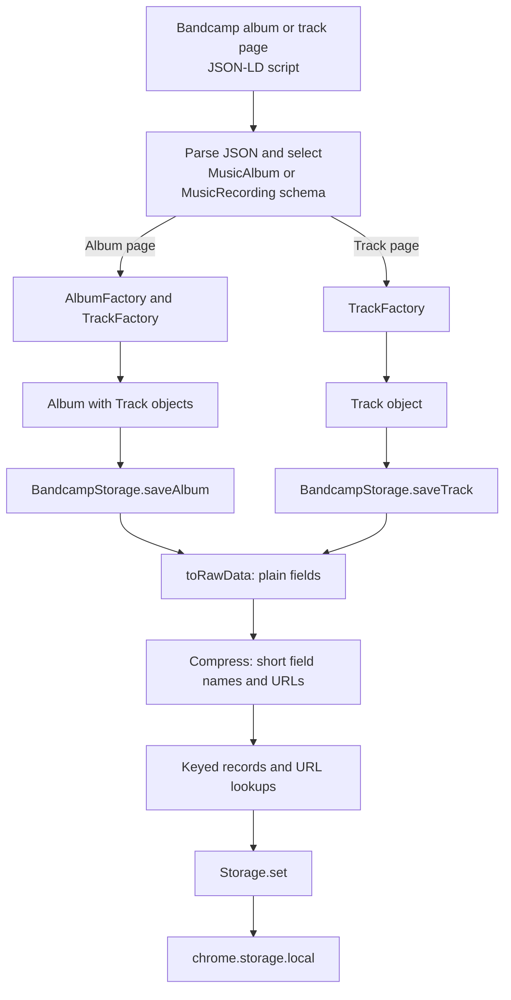
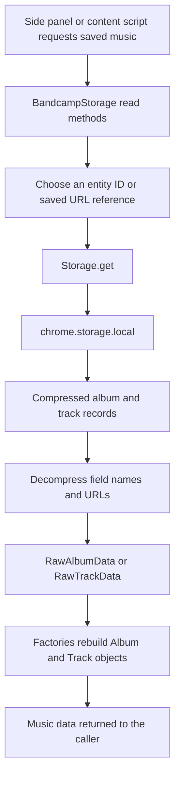

# Music data storage flows

## Writing music data

Album and track pages provide JSON-LD schema data in the HTML. The content script turns that data into BCX models, then saves compressed records in Chrome local storage.

`saveAlbum` includes the album and any tracks that are not already stored. An album record keeps track IDs rather than full Track objects. Stored records use `/a/{id}` and `/t/{id}` keys, with URL lookup keys pointing to those records when a URL is available.

This chart covers album and track pages. The artist music page builds band data from page content through a separate path.

## Reading music data

The side panel and content scripts read saved albums and tracks through `BandcampStorage`.

A URL reference requires a first storage lookup to find its entity key. Album reads can then follow stored track IDs, load those track records, and attach the reconstructed Tracks to the Album. Direct track reads rebuild a Track from its compressed record.
