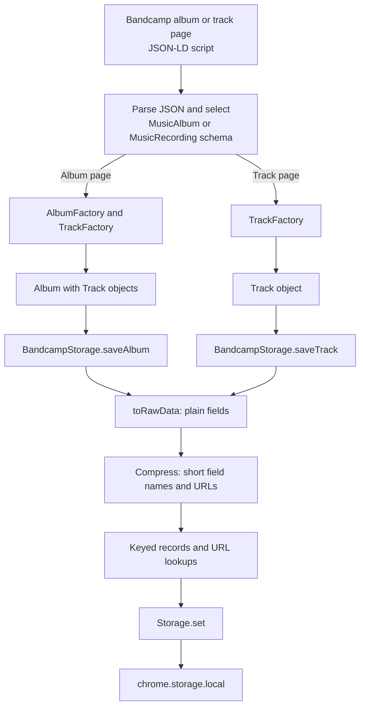
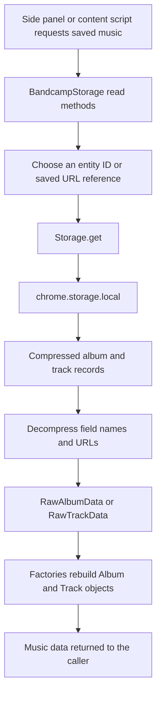

# Music data storage flows

## Writing music data

Album and track pages provide JSON-LD schema data in the HTML. The content script turns that data into BCX models, then saves compressed records in Chrome local storage.

```mermaid
flowchart TB
    html[Bandcamp album or track page<br/>JSON-LD script]
    schema[Parse JSON and select<br/>MusicAlbum or MusicRecording schema]
    html --> schema

    schema -->|Album page| albumFactory[AlbumFactory and TrackFactory]
    schema -->|Track page| trackFactory[TrackFactory]
    albumFactory --> album[Album with Track objects]
    trackFactory --> track[Track object]

    album --> saveAlbum[BandcampStorage.saveAlbum]
    track --> saveTrack[BandcampStorage.saveTrack]
    saveAlbum --> raw[toRawData: plain fields]
    saveTrack --> raw
    raw --> compressed[Compress: short field names and URLs]
    compressed --> keyed[Keyed records and URL lookups]
    keyed --> wrapper[Storage.set]
    wrapper --> local[chrome.storage.local]
```

`saveAlbum` includes the album and any tracks that are not already stored. An album record keeps track IDs rather than full Track objects. Stored records use `/a/{id}` and `/t/{id}` keys, with URL lookup keys pointing to those records when a URL is available.

This chart covers album and track pages. The artist music page builds band data from page content through a separate path.

## Reading music data

The side panel and content scripts read saved albums and tracks through `BandcampStorage`.

```mermaid
flowchart TB
    request[Side panel or content script requests saved music]
    read[BandcampStorage read methods]
    lookup[Choose an entity ID or saved URL reference]
    get[Storage.get]
    local[chrome.storage.local]
    records[Compressed album and track records]
    expanded[Decompress field names and URLs]
    raw[RawAlbumData or RawTrackData]
    models[Factories rebuild Album and Track objects]
    result[Music data returned to the caller]

    request --> read --> lookup --> get --> local
    local --> records --> expanded --> raw --> models --> result
```

A URL reference requires a first storage lookup to find its entity key. Album reads can then follow stored track IDs, load those track records, and attach the reconstructed Tracks to the Album. Direct track reads rebuild a Track from its compressed record.

## Fan library and unavailable entries

`src/bandcamp/domain/fanData/library.ts` keeps the original `/collection`,
`/wishlist`, `/following-bands`, and `/following-genres` array fields. Collection,
Wishlist, and Following Bands display these saved entries before the first sync,
without an import step. The array shape stays compatible with existing readers.
Account-scoped membership and saved history remain at `/fan-data/account/{fanId}`. Each dataset retains all previously seen records and a
separate ordered list of current IDs. Missing IDs are never deleted. Releases use
`a:{id}` or `t:{id}`, bands use `band:{id}`, and genre identities use their tag URL.
Successful snapshots merge fields; absent/null fields do not erase saved metadata.
Existing detailed `BandcampStorage` records remain intact.

`/fan-data/account/{fanId}/unavailable` is a separate registry of confirmed
unavailable references, with URLs, timestamps and reasons. The account's
`/availability` registry also records accessible and inconclusive checks. Only
HTTP 404/410 at the requested URL adds an Unavailable entry. Redirects, challenges,
unsupported custom domains and request failures remain inconclusive. An accessible
Bandcamp page removes an earlier Unavailable status. List membership is independent:
a missing item can still be accessible (for example, an unfollowed band).

Sync checks missing records and previously unavailable records in the selected
list. The toolbar also offers a check of all saved release/band pages, including
items still in current lists. Oldest/unattempted checks run first so retries after
a timeout make progress. Results are saved incrementally. Genres retain historical
membership but do not receive page-availability classifications.

Collection, Wishlist, and Following Bands show all saved entries in their first
catalog tab. Their Unavailable tab appears before No longer listed. Following
Genres keeps its Current and All saved membership tabs. Following badges use
current membership, so a saved band missing from the latest list is not shown as
currently followed.
The Sync toolbar sits above the subtabs in each fan-data panel. Artist and release
pages identify the signed-in fan through `identities.fan.id` (with a `fan_id`
fallback). Without a verified account, the toolbar remains visible but disabled
with a sign-in message, and empty archive tabs remain visible.

History keeps All, Bands, Releases, and Tracks subtabs. Search stays within the
selected type, and pagination remains in batches of 50.
After the Collection page verifies the account and returns a complete dataset,
sync validates the response and stages it at
`/fan-data/account/{fanId}/staging/{dataset}`. It merges the existing shared array
and account history by stable ID, then publishes the merged array, account metadata,
and ownership revision in one storage write. Fresh items come first; saved missing
entries remain afterward. Failed validation or publishing leaves prior saved data
intact; staging is removed after the attempt and is never read by the panels.

`/fan-data/saved-list-owners` records the fan ID and revision for each shared array.
Previously unassigned arrays are adopted during a verified sync. A list already
owned by another account is not adopted; that account retains its own saved copy.
When switching accounts, panels use the matching account history if the shared
array belongs to another fan. Ordinary sync now includes older data automatically;
the former explicit import action remains supported only for message compatibility.

`/fan-data/sync-job` stores job progress and errors. An interrupted worker marks the
job interrupted on its next startup; retry preserves already committed data.
The manifest requests `unlimitedStorage` because the retained music archive and
staging snapshots can outgrow Chrome's default 10 MB local-storage quota. Reload
the extension after this manifest change. Storage callbacks normalize Chrome's
plain `runtime.lastError` objects into JavaScript Errors, preserving their message.
Sync errors include the failing step and any datasets already published, and the
panel suppresses the initial saved-list notice while a failure is displayed.
Storage failures are reported as errors rather than successful syncs.
Saved artwork URLs are retained, but image bytes and audio are not archived.

Sync requests check the background worker's protocol version before starting a
job. Jobs carry that version so the UI can identify saved errors produced by an
older worker and explain that BCX must be reloaded in `chrome://extensions`,
followed by refreshing Bandcamp. Reloading only the web page does not update the
extension service worker.

Temporary sync tabs are created inactive in the originating tab's window and
excluded from side-panel configuration. Cleanup closes only a still-owned,
inactive temporary tab; it preserves activated tabs, navigated tabs, and the
originating tab. Background side-panel configuration ignores missing URLs and
unchanged enablement, avoiding redundant reconfiguration during background work.
Concurrent storage-read timings use elapsed timestamps rather than shared
console timer labels.
