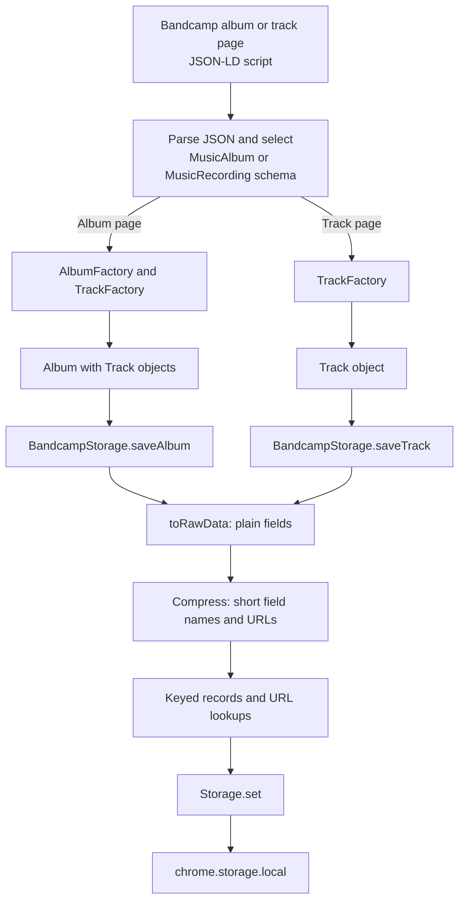
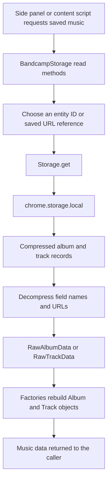

# Music data storage flows

## Writing music data

Album and track pages provide JSON-LD schema data in the HTML. The content script turns that data into BCX models, then saves compressed records in Chrome local storage.

```mermaid
flowchart TB
    html[Bandcamp album or track page<br/>JSON-LD script]
    schema[Parse JSON and select<br/>MusicAlbum or MusicRecording schema]
    html --> schema

    schema -->|Album page| albumFactory[AlbumFactory and TrackFactory]
    schema -->|Track page| trackFactory[TrackFactory]
    albumFactory --> album[Album with Track objects]
    trackFactory --> track[Track object]

    album --> saveAlbum[BandcampStorage.saveAlbum]
    track --> saveTrack[BandcampStorage.saveTrack]
    saveAlbum --> raw[toRawData: plain fields]
    saveTrack --> raw
    raw --> compressed[Compress: short field names and URLs]
    compressed --> keyed[Keyed records and URL lookups]
    keyed --> wrapper[Storage.set]
    wrapper --> local[chrome.storage.local]
```

`saveAlbum` includes the album and any tracks that are not already stored. An album record keeps track IDs rather than full Track objects. Stored records use `/a/{id}` and `/t/{id}` keys, with URL lookup keys pointing to those records when a URL is available.

This chart covers album and track pages. The artist music page builds band data from page content through a separate path.

## Reading music data

The side panel and content scripts read saved albums and tracks through `BandcampStorage`.

```mermaid
flowchart TB
    request[Side panel or content script requests saved music]
    read[BandcampStorage read methods]
    lookup[Choose an entity ID or saved URL reference]
    get[Storage.get]
    local[chrome.storage.local]
    records[Compressed album and track records]
    expanded[Decompress field names and URLs]
    raw[RawAlbumData or RawTrackData]
    models[Factories rebuild Album and Track objects]
    result[Music data returned to the caller]

    request --> read --> lookup --> get --> local
    local --> records --> expanded --> raw --> models --> result
```

A URL reference requires a first storage lookup to find its entity key. Album reads can then follow stored track IDs, load those track records, and attach the reconstructed Tracks to the Album. Direct track reads rebuild a Track from its compressed record.

## Fan library and unavailable entries

`src/bandcamp/domain/fanData/library.ts` owns account-scoped snapshots at
`/fan-data/account/{fanId}`. Each dataset retains all previously seen records and a
separate ordered list of current IDs. Missing IDs are never deleted. Releases use
`a:{id}` or `t:{id}`, bands use `band:{id}`, and genre identities use their tag URL.
Successful snapshots merge fields; absent/null fields do not erase saved metadata.
Existing detailed `BandcampStorage` records remain intact.

`/fan-data/account/{fanId}/unavailable` is a separate registry of confirmed
unavailable references, with URLs, timestamps and reasons. The account's
`/availability` registry also records accessible and inconclusive checks. Only
HTTP 404/410 at the requested URL adds an Unavailable entry. Redirects, challenges,
unsupported custom domains and request failures remain inconclusive. An accessible
Bandcamp page removes an earlier Unavailable status. List membership is independent:
a missing item can still be accessible (for example, an unfollowed band).

Sync checks missing records and previously unavailable records in the selected
list. The toolbar also offers a check of all saved release/band pages, including
items still in current lists. Oldest/unattempted checks run first so retries after
a timeout make progress. Results are saved incrementally. Genres retain historical
membership but do not receive page-availability classifications.

Panels show current catalogs plus Unavailable, No longer listed, and All saved.
The Sync toolbar sits above the subtabs in each fan-data panel. Artist and release
pages identify the signed-in fan through `identities.fan.id` (with a `fan_id`
fallback). Without a verified account, the toolbar remains visible but disabled
with a sign-in message, and empty archive tabs remain visible. Unavailable appears
beside the primary catalog tab.

History also has an Unavailable subtab, matching visited Bandcamp URLs against the
current account's confirmed unavailable registry. It does not check every history
entry over the network. Search stays within those matching entries, pagination
remains in batches of 50, and storage changes refresh already loaded panels.
Unassigned legacy `/collection`, `/wishlist`, `/following-bands`, and
`/following-genres` arrays remain unchanged and visible under Older saved lists.
The explicit Import older saved lists action assigns copies to the verified account
and syncs it; it never deletes the originals or overwrites newer account records.
No automatic account assignment is inferred from these older global keys.

`/fan-data/sync-job` stores job progress and errors. An interrupted worker marks the
job interrupted on its next startup; retry preserves already committed data.
Local storage quota failures are reported as errors rather than successful syncs.
Saved artwork URLs are retained, but image bytes and audio are not archived.
